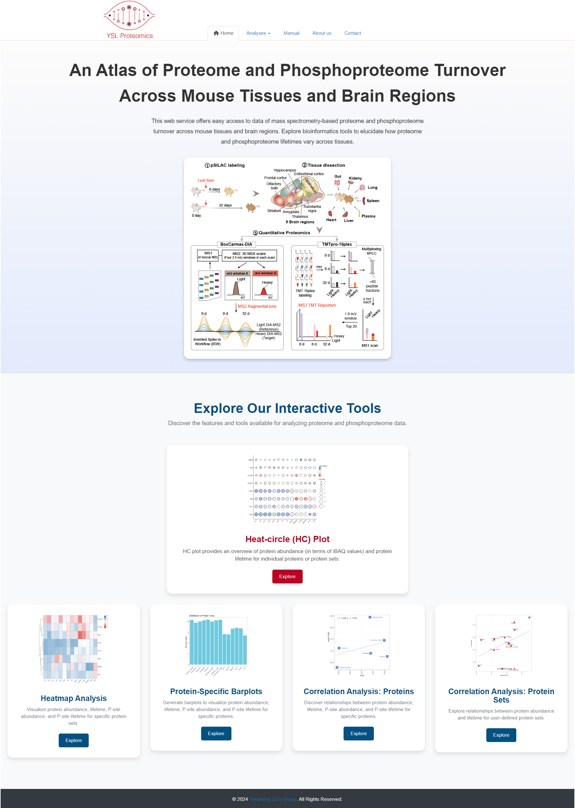

# tissuePPT
Tissue Proteome and Phosphoproteome Turnover Web Application

## Brief Description
**<font size='5'> Tissue-PPT </font>** is a comprehensive resource that maps protein abundance (PA) and protein lifetime (PT) across eight mouse tissues and nine brain regions, providing in-depth insights into tissue-specific proteostasis. Using advanced proteomic techniques of data-independent acquisition (DIA) and tandem mass tagging (TMTpro), Tissue-PPT analyzed 11,000 proteins and 40,000 phosphosites with their PA and PT profiles, offering unmatched coverage and precision. Tissue-PPT uncovers e.g., tissue-specific short- and long-lived proteins, the role of phosphorylation in regulating protein stability, and how protein-protein interactions and organellar localization influence proteostasis and protein lifetime. By integrating multi-omics datasets, Tissue-PPT provides a detailed atlas of protein dynamics and tissue-specific regulation, offering new therapeutic insights. Accessible through an interactive web portal, Tissue-PPT serves as a valuable tool for studying proteome and phosphoproteome turnover in health and disease. This software (online version) is available here: [https://yslproteomics.shinyapps.io/tissuePPT](https://yslproteomics.shinyapps.io/tissuePPT). **Please note**: If the data are too large, we recommend users to intall this tool locally. Local installation can be found below.

## Graphical Abstract
<div style="text-align: center;">
  
</div>

## How to use
A detailed introduction of this software can be found in the [User Manual](https://github.com/yslproteomics/tissuePPT/blob/main/tissuePPT.UserManual.pdf).

## Run it locally
This tool is developed with R, so if you want to run it locally, you may do some preparatory work:  
**1. Install R.** You can download R from here: [https://www.r-project.org/](https://www.r-project.org/).  
**2. Install RStudio.** (Recommendatory but not necessary). You can download RStudio from here: [https://www.rstudio.com/](https://www.rstudio.com/).  
**3. Check packages.** After installing R and RStudio, you should check whether you have installed these packages (shiny, shinyjs, shinyWidgets, shinyBS, DT, data.table, ggsci, ggplot2, ggrepel, patchwork, dplyr, openxlsx, cowplot, grid, ggpubr, impute, pheatmap, ggplotify). You may run the codes below to check them:  

```r
if(!require(pacman)) install.packages("pacman")
pacman::p_load(shiny, shinyjs, shinyWidgets, shinyBS, DT, data.table, ggsci, ggplot2, ggrepel, patchwork, dplyr, openxlsx, cowplot, grid, ggpubr, impute, pheatmap, ggplotify)
```

If the preparatory work has been done, you can run this tool locally as below:
```r
if(!require(tissuePPT)) devtools::install_github("yslproteomics/tissuePPT")
library(tissuePPT)
tissuePPT_app()
```

**Please note**, as there are many datasets, this package is large. If you have some issues when you install it using the code above, _please try download it into your own computer and install locally_. And please also feel free to write an issue or e-mail to me if you have any problem about this software.

Then tissuePPT will be started as below:  
<div style="text-align: center;">
  
</div>
<br>

## Friendly suggestions
1. Open tissuePPT with Chrome, Mozilla Firefox, Safari or Firefox.
2. The minimum operating system specifications are: **RAM 4GB, Hard drive 500 GB.**
3. The monitor resolution (>= 1920x1080) is better.

## Contact
You could push an issue on this github. And optionally, please feel free to sent me an e-mail if you have any question or find a bug about this tool. Thank you^_^
Email: shishengwk@gmail.com.


